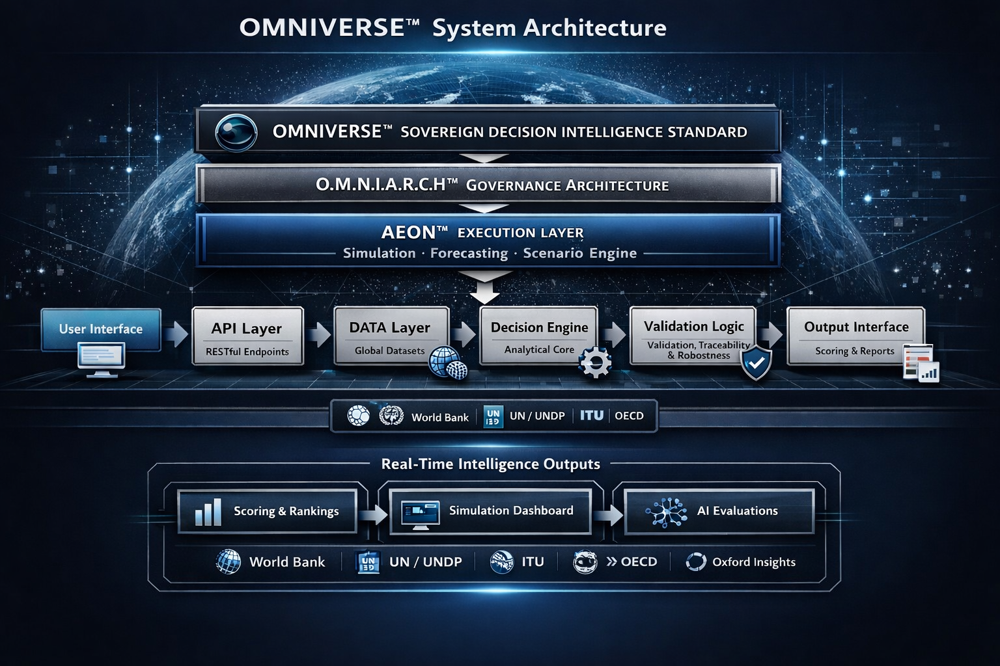

# 🌐 OMNIVERSE™  
## Sovereign Decision Intelligence Standard  

[](https://doi.org/10.5281/zenodo.19430636)  
  
  
  
  

---

## 📖 Executive Summary  

OMNIVERSE™ is a mathematically formalized, sovereign-neutral global decision intelligence standard designed to evaluate, optimize, and certify decision systems across governance, artificial intelligence, and multi-agent environments.  

It is a deployment-grade computational platform integrating:  

- Deterministic decision modeling  
- Real-time analytical evaluation  
- API-driven intelligence outputs  
- Interactive dashboard visualization  
- Reproducible and auditable architecture  

OMNIVERSE™ establishes a unified decision sovereignty layer across national, institutional, and global systems.  

---

## 🌐 Live System Access  

- Website: https://bidyutmazumdar.github.io/omniverse-global-decision-standard/  
- Dashboard: https://bidyutmazumdar.github.io/omniverse-global-decision-standard/dashboard.html  
- AI Engine: https://bidyutmazumdar.github.io/omniverse-global-decision-standard/ai.html  
- Simulator: https://bidyutmazumdar.github.io/omniverse-global-decision-standard/simulator.html  
- API (Local): http://localhost:3000  

---

## 🧩 Architecture Diagram  

## 🌐 OMNIVERSE™ System Architecture  

  

**Figure 1: OMNIVERSE™ System Architecture**  

OMNIVERSE™ integrates governance architecture (**O.M.N.I.A.R.C.H™**) with an execution layer (**AEON™**) to enable real-time simulation, validation, and strategic intelligence outputs.  

---

## 🏗️ Core Architecture  

### 🔷 OMNIVERSE™ Standard  
Global sovereign decision intelligence layer  

### 🔷 O.M.N.I.A.R.C.H™  
Governance architecture defining structural logic and policy alignment  

### 🔷 AEON™ Execution Layer  
- Simulation  
- Forecasting  
- Scenario Engine  

---

## 🔄 System Pipeline  

```
User Interface  
   ↓  
API Layer (RESTful Endpoints)  
   ↓  
Data Layer (Global Datasets)  
   ↓  
Decision Engine (Analytical Core)  
   ↓  
Validation Logic (Traceability + Robustness)  
   ↓  
Output Interface (Scoring & Reports)  
```

---

## ⚙️ Key Capabilities  

- 🌍 Real-time global intelligence  
- 🤖 AI-driven simulation and forecasting  
- 📊 Multi-dimensional scoring systems  
- 🔍 Validation, traceability, and robustness  
- 🧠 Decision support for governments & enterprises  

---

## 🌍 Data Sources  

OMNIVERSE™ integrates real-world global datasets:  

- World Bank API (GDP, infrastructure, macro indicators)  
- UN / UNDP (Human Development Index)  
- ITU (Cybersecurity & digital resilience metrics)  

All datasets are normalized into a unified [0–1] decision scale.  

---

## 🌐 Global Alignment  

Aligned with international institutional frameworks:  

- World Bank  
- United Nations (UN / UNDP)  
- ITU  
- OECD  
- Oxford Insights  

---

## 📊 Outputs  

- Real-time intelligence outputs  
- Global scoring & rankings  
- Simulation dashboards  
- AI evaluation reports  

---

## 🧪 Use Cases  

- National policy simulation  
- Economic forecasting  
- Infrastructure planning  
- Climate strategy modeling  
- AI governance systems  

---

## 🧮 Mathematical Foundation  

```
D = f(I, A, R, C, T)

Ds = (I × A × C) / (R × σt)

Io = ∑(wᵢ × Xᵢₙ)

Cs = Io × Rs × AGAPₙ × e^(−σt)

Ad = (Cs × Co × Io × Rs) × e^(−σt)
```

---

## 🔌 API Surface  

| Endpoint         | Type | Description                  |
|----------------|------|------------------------------|
| /              | GET  | System status                |
| /ai            | POST | AI decision evaluation       |
| /data/combined | GET  | Unified dataset              |
| /score/all     | GET  | Global scoring output        |
| /score/top     | GET  | Top ranked systems           |

**Example:**
```
curl http://localhost:3000/score/all
```

---

## 📚 Citation  

```
Mazumdar, B. (2026).  
OMNIVERSE™ — Global Decision Sovereignty & Strategic Intelligence Standard (v1.0).  
Zenodo. https://doi.org/10.5281/zenodo.19430636
```

---

## 🧾 Author  

Dr. B. Mazumdar, D.Sc. (Hon.), D.Litt. (Hon.)  
Architect of Modern Statehood  
Founder & Principal Architect, FAIR+D Canon™  

ORCID: https://orcid.org/0009-0007-5615-3558  

---

## ⚖️ License  

Proprietary License  
All rights reserved  
No commercial use without permission  
No derivative redistribution  

---

## 🚀 Vision  

OMNIVERSE™ aims to establish a universal standard for decision intelligence, bridging AI, governance, and global systems into a single interoperable framework.  

---

> “From data to decision — from simulation to sovereignty.”  

---
